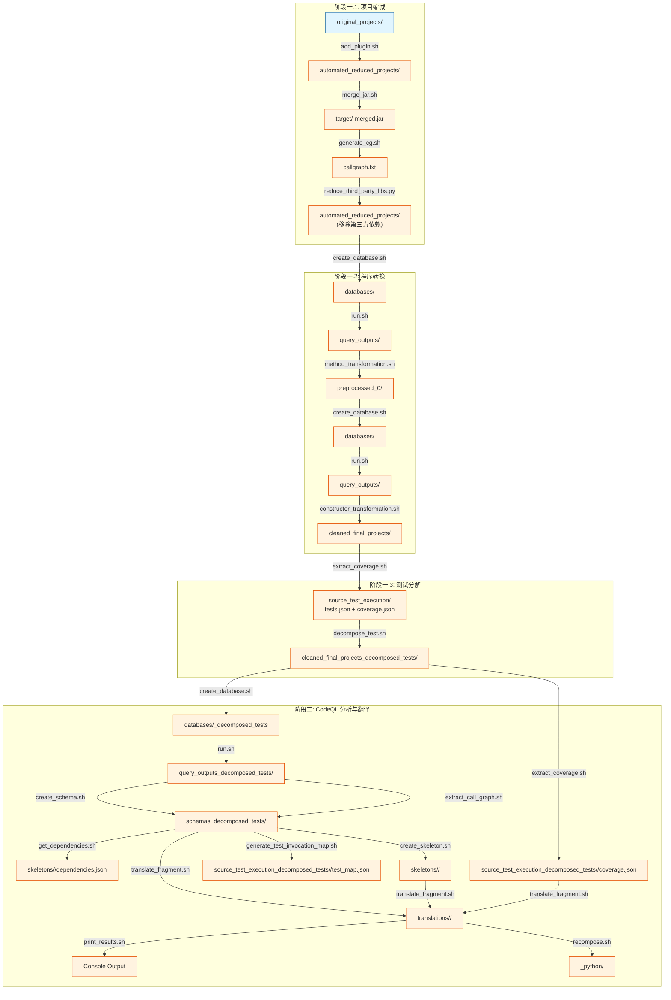

# 项目预处理与翻译流程指南

## 阶段一：项目预处理

### 1.1 添加 <project> JAR 插件

**命令：**

```bash
bash scripts/add_plugin.sh <project>
```

- **作用：** 将 `<project>-jar-plugin` 添加到项目的 `pom.xml`，用于生成测试 JAR。
- **生成文件：** `java_projects/automated_reduced_projects/<project>/` 目录（从 `original_projects` 复制并添加插件）。

------

### 1.2 构建项目并合并 JAR

**命令：**

```bash
bash scripts/merge_jar.sh <project>
```

- **作用：** 执行 `mvn clean install` 构建项目，将主代码和测试代码合并成单个 JAR。
- **依赖：** 需要 Java 和 <project> 环境。
- **生成文件：**
  - `java_projects/automated_reduced_projects/<project>/target/*.jar` (主 JAR)
  - `java_projects/automated_reduced_projects/<project>/target/*-tests.jar` (测试 JAR)
  - `java_projects/automated_reduced_projects/<project>/target/*-merged.jar` (合并后的 JAR)

------

### 1.3 生成调用图

**命令：**

```Bash
bash scripts/generate_cg.sh <project>
```

- **作用：** 使用 `JavaCallgraph` 工具生成项目的调用图。
- **依赖：** `misc/java-callgraph/target/javacg-0.1-SNAPSHOT-static.jar`
- **生成文件：** `java_projects/automated_reduced_projects/<project>/callgraph.txt`

------

### 1.4 缩减第三方依赖

**命令：**

```Bash
python3 src/preprocessing/reduce_third_party_libs.py <project>
```

- **作用：** 分析调用图，移除未使用的第三方依赖，只保留项目自身的代码。
- **输入：** `callgraph.txt` 和原始项目。
- **生成文件：** `java_projects/automated_reduced_projects/<project>/` (更新后的项目)。
- **注意：** 执行此步后，需要重新创建 CodeQL 数据库。

------

### 2.1 创建 CodeQL 数据库

**命令：**

```Bash
bash scripts/create_database.sh <project> automated_reduced_projects ""
```

- **作用：** 为预处理后的项目创建 CodeQL 数据库。
- **生成文件：** `databases/<project>/`

------

### 2.2 执行 CodeQL 查询

**命令：**

```Bash
bash queries/run.sh <project> "_decomposed_tests"  
```

- **作用：** 运行 CodeQL 查询，提取类型、方法调用等信息。
- **生成文件：** `data/query_outputs/`

---

### 2.3 方法转换（处理重载方法）

**命令：**

```Bash
bash scripts/method_transformation.sh <project>
```

- **作用：** 将重载方法转换为唯一命名的方法（解决 Python 不支持重载的问题）。
- **依赖：** 需要 CodeQL 数据库在 `data/query_outputs/` 目录下。
- **生成文件：** `java_projects/preprocessed_0/<project>/`
- **注意：** 方法转换后需要重新创建数据库。

---

### 2.1 重新创建 CodeQL 数据库

**命令：**

```Bash
bash scripts/create_database.sh <project> preprocessed_0 ""
```

- **作用：** 为预处理后的项目创建 CodeQL 数据库。
- **生成文件：** `databases/<project>/`

------

### 2.2 重新执行 CodeQL 查询

**命令：**

```Bash
bash queries/run.sh <project> "_decomposed_tests"  
```

- **作用：** 运行 CodeQL 查询，提取类型、方法调用等信息。
- **生成文件：** `data/query_outputs/`

------

### 2.4 构造函数转换

**命令：**

```Bash
bash scripts/constructor_transformation.sh <project>
```

- **作用：** 将重载构造函数转换为唯一命名的方法。
- **依赖：** 需要 CodeQL 数据库在 `data/query_outputs/` 目录下。
- **生成文件：** `java_projects/cleaned_final_projects/<project>/`
- **注意：** 此步骤后需要验证项目能否通过 <project> 编译。

------

### 3.1 测试分解

测试分解分为两步：

**第一步：提取测试覆盖率**

```Bash
bash scripts/extract_coverage.sh <project> ''
```

- **作用：** 执行测试并提取覆盖率信息。
- **生成文件：** `data/source_test_execution/` 目录。
- **注意：** 运行脚本前需要进行测试: *`mvn test`*,并添加 *`jacoco`* 插件

**第二步：分解测试**

```Bash
bash scripts/decompose_test.sh
```

- **作用：** 将测试分解为独立片段，解决长调用链问题。
- **生成文件：** `java_projects/cleaned_final_projects_decomposed_tests/<project>/`
- **注意：** 测试分解后可能需要手动调整，如移除 `@Test(expected = ...)` 注解。

------

## 阶段二：CodeQL 分析与翻译

### 1.1 创建 CodeQL 数据库

**命令：**

```Bash
bash scripts/create_database.sh <project> cleaned_final_projects_decomposed_tests "_decomposed_tests"

```

- **作用：** 为预处理后的项目创建 CodeQL 数据库。
- **生成文件：** `databases/<project>_decomposed_tests/`
- **注意：** 此脚本只处理固定的 10 个项目列表，需要手动修改或为 `<project>` 创建单独版本。

------

### 2.2 执行 CodeQL 查询

**命令：**

```Bash
bash queries/run.sh <project> "_decomposed_tests"  
```

- **作用：** 运行 CodeQL 查询，提取类型、方法调用等信息。
- **生成文件：** `data/query_outputs_decomposed_tests/`

------

### 2.3 程序分解

**命令：**

```Bash
bash scripts/create_schema.sh _decomposed_tests
bash scripts/extract_call_graph.sh _decomposed_tests
```

- **作用：** 根据 CodeQL 查询结果创建项目 schema（JSON 格式）。
- **生成文件：** `data/schemas_decomposed_tests/<project>/`

------

### 2.4 生成骨架结构

**命令：**

```Bash
bash scripts/get_dependencies.sh _decomposed_tests
bash scripts/create_skeleton.sh _decomposed_tests
```

- **作用：** 在目标语言中 `data/skeletons/<project_name>` 下创建合适的骨架（语法正确的空实现）。
- **生成文件：** 更新到 `data/skeletons/<project_name>`。

------

### 2.5 翻译

**命令：**

```Bash
bash scripts/generate_test_invocation_map.sh _decomposed_tests
bash scripts/extract_coverage.sh <project_name> _decomposed_tests
bash scripts/translate_fragment.sh <project_name> <temperature> <model>
```

- **作用：** 提取测试覆盖率，用于指导翻译。
- **生成文件：** `data/source_test_execution/`

------

### 2.6 执行翻译

**命令：**

```Bash
bash scripts/translate_fragment.sh <project> 0.0 gpt-4o-2024-11-20
```

- **作用：** 调用 LLM 翻译代码片段，按反向调用图顺序执行。
- **参数：**
  - `<project>` - 项目名
  - `0.0` - temperature
  - `gpt-4o-2024-11-20` - 模型名
- **依赖：** `configs/model_configs.yaml` 中配置了 API。
- **生成文件：** `data/schemas_decomposed_tests/translations/<project>/` (JSON 格式翻译结果)。

------

### 2.7 查看翻译结果

**命令：**

```Bash
bash scripts/print_results.sh <project> 0.0 gpt-4o-2024-11-20 data/schemas_decomposed_tests/translations
```

- **作用：** 打印翻译结果统计（语法正确性、GraalVM 正确性、测试通过率等）。

------

### 2.8 重组为独立 Python 项目

**命令：**

```Bash
bash scripts/recompose.sh <project> 0.0 gpt-4o-2024-11-20
```

- **作用：** 将翻译片段组合成独立的 Python 项目。
- **生成文件：** `data/schemas_decomposed_tests/translations/<project>_python/`

------

## 文件流程图



## 关键文件路径汇总

| 类型 | 路径 |
|------|------|
| 原始项目 | `java_projects/original_projects/<project>/` |
| 缩减后项目 | `java_projects/automated_reduced_projects/<project>/` |
| 方法转换后 | `java_projects/preprocessed_0/<project>/` |
| 最终预处理 | `java_projects/cleaned_final_projects/<project>/` |
| 测试分解后 | `java_projects/cleaned_final_projects_decomposed_tests/<project>/` |
| CodeQL 数据库 | `databases/<project>/` |
| CodeQL 数据库(分解后) | `databases/<project>_decomposed_tests/` |
| 查询输出 | `data/query_outputs/<project>/` |
| 查询输出(分解后) | `data/query_outputs_decomposed_tests/<project>/` |
| 项目 Schema | `data/schemas_decomposed_tests/<project>/` |
| 骨架代码 | `data/skeletons/<project>/` |
| 翻译结果 | `data/schemas_decomposed_tests/translations/<project>/` |
| Python 项目 | `data/schemas_decomposed_tests/translations/<project>_python/` |

## 说明

1. **手动调整：** 测试分解后可能需要手动调整，确保 <project> 能编译。
2. **模型配置：** 翻译需要配置 LLM API，当前 `configs/model_configs.yaml` 已配置 `gpt-4o-2024-11-20`。
3. **中途可能需要重新运行测试代码:** `cd /home/AlphaTrans/java_projects/cleaned_final_projects_decomposed_tests/<project> && mvn clean test -Drat.skip=true`

